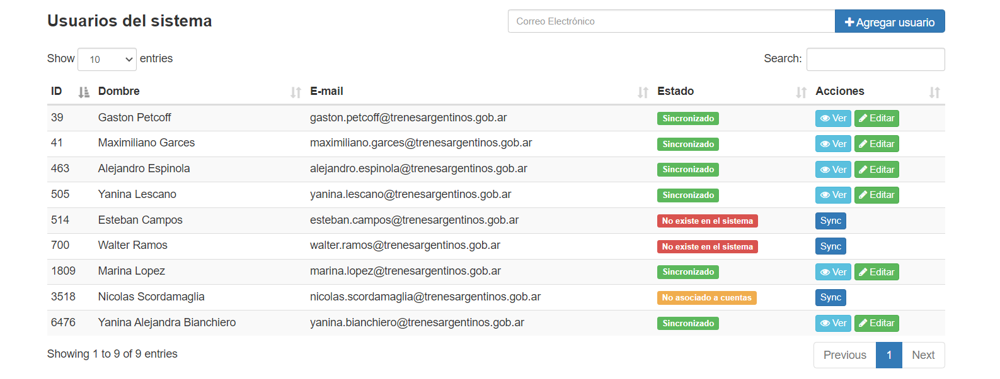

### LoginCuentas
<b>loginCuentas</b> es una librería que le permite integrar la autenticación de Laravel al sistema de cuentas de Trenes Argentinos.

Esta librería genera todas las rutas, vistas, controladores, etc, necesarios para el proceso de autenticación, por lo tanto usted no debe usar el comando que provee Laravel `php artisan make:auth`.

Ademas de resolver el proceso de autenticación, esta librería provee:
- Una interfaz gráfica para la gestión de usuarios
- Dos middlewares, "CheckToken" y "RefreshToken"  

Internamente usa el protocolo de autenticación Oauth2 mediante el package ["league/oauth2-client"](https://packagist.org/packages/league/oauth2-client) 

#### Requerimientos
- laravel: ^7
- composer 
- En la DB de su aplicación debe existir la tabla <b>users</b> con los campos `id` , `name` y `email` (Laravel al incluye por defecto y se genera al ejecutar el comando `php artisan migrate`)

#### Instalacion

`composer require alexespinola/login-cuentas`

#### Configuración

En el archivo  `.env` de su aplicaión defina las credenciales de autenticación:

- `clientId=<clientId>`
- `clientSecret=<clientId>` 
- `redirectUri=http://<path-to-your-proyect>/authorize`

Opcionalmente puede definir tambien:
- `urlAuthorize=https://cuenta.sofse.gob.ar/oauth2/authorize/`
- `urlAccessToken=https://cuenta.sofse.gob.ar/oauth2/token/`
- `urlResourceOwnerDetails=https://cuenta.sofse.gob.ar/api/user/`
- `urlApiCuentas=https://cuenta.sofse.gob.ar/api/`

##### Archivo de configuración
Publique la config de esta librería con el siguiente comando:

`php artisan vendor:publish --provider="loginCuentas\LoginCuentasServiceProvider" --tag="config"`

Esto crea un archivo de configuración en su aplicación: `config/loginCuentas.php`
En este archivo usted puede definir:
- La URL a donde redirigir despues del login `'urlRedirectAfterLogin'`.
- La URL para mostrar la vista SHOW de usuarios `urlShowUser`.
- La URL para mostrar la vista EDIT de usuarios `urlEditUser`.

La librería no implementa la funcianalidad para editar o ver detalle de un usuario. Usted debe crear un `userController` en su aplicación que haga estas tareas ademas de las vistas y rutas correspondientes.

##### Middlewares
Esta librería provee dos middlewares:
 `RefreshToken`: Para renovar el token de usuario automaticamente cuando este expire.
 `CheckToken`: Para autenticar mediante el header "Authorization" las peticiones a APIs que exponga su aplicaón.

Usted puede usar estos middlewares tanto en grupos de rutas como en el constructor de sus controladores.

###### En grupos de rutas;
```php
Route::group(['middleware' => ['RefreshToken']], function() {
  Route::get('/home', function () {
    return view('home');
  });
  ...
});
```

###### En el constructor de los controladores;
```php
public function __construct() {
    $this->middleware('CheckToken');
}
```

##### Evento UserWasLogged 
Es probable que usted necesite realizar acciones cuando un usuario se loguea en su aplicacíon como por ejemplo:
  - Guardar los permisos del usuario en una variable de sesión
  - Registrar los accesos a la aplicación

Para esto la librería <b>LoginCuentas</b> emite un evento <b>UserWasLogged</b> para que usted pueda registrar un Listener en su aplicación que escuche dicho evento y realice las acciones que usted desee. 

###### Instruciones para implementes el Listener

1- Cree el listener  `App\Listeners\afterUserLogged.php` siguiendo el ejemplo que se muestra abajo  y codifique las acciones que desee en el método <b>handle</b>. 
NOTE que la variable <b>$event->userID</b> contien el ID del usuario logueado.

```php
<?php

namespace App\Listeners;

use loginCuentas\Events\UserWasLogged;
use App\User;
use Session;

class afterUserLogged
{
    /**
     * Create the event listener.
     *
     * @return void
     */
    public function __construct() {
      
    }

    /**
     * Handle the event.
     *
     * @param  \App\Events\UserWasLogged  $event
     * @return void
     */
    public function handle(UserWasLogged $event)
    {
        //COMO EJEMPLO: define una variable de sección con los datos del usuario
        $user = User::find($event->userID)->toJson();
        Session::put('user', $user);
    }
}
```

2- Registre el Event y el Listener en el archivo `App\Providers\EventServiceProvider.php` dentro del array `protected $listen`:

```php
use loginCuentas\Events\UserWasLogged;
use App\Listeners\afterUserLogged;

class EventServiceProvider extends ServiceProvider
{
    /**
     * The event listener mappings for the application.
     *
     * @var array
     */
    protected $listen = [
        UserWasLogged::class =>[
            afterUserLogged:: class,
        ]
    ];

    ...
```

NOTE que se importan el evento desde la librería <b>loginCuentas</b> y el listener que usted creó desde su aplicación. 

##### Modificar vistas
Si usted quiere modificar las vistas que provee este paquete debe puplicarlas con el siguiente comando: 

`php artisan vendor:publish --provider="loginCuentas\LoginCuentasServiceProvider" --tag="views"`

Esto crea una carpeta con todas las vistas en su aplicación en `resources/views/vendor/loginCuentas`

##### Las rutas y vista de usuarios
La libreria provee tres rutas para la gestion de usuarios
- `GET /users` - Muestra el listado de usuarios (como se muestra en la imagen de abajo).
- `POST /users` - Para la creación de usuarios.
- `GET /users-sync` - Para sincronizar los usuarios de cuentas con su aplicación o viseversa. 



NOTE que cada usuario tiene un "estado":
- `Sincronizado`: Registrado en la DB de su aplicación y cuentas.sofse.gob.ar.  
- `No existe en el sistema`: Registrado en cuentas.sofse.gob.ar pero no es su aplicación.  
- `No asociado a cuentas`: Registrado en la DB de su aplicación pero no en cuentas.sofse.gob.ar. 

NOTE que cuando el usuario no está "Sincronizado" se muestra un botón "Sync" que al presionarlo sincronizará la información del usuario en cuentas.sofse.gob.ar con la de la DB de su aplicación.

Es posible que usted quiera embeber la vista de usuarios en el template `app.balde.php` de su aplicación: Para hacerlo solo debe publicar las vistas y reemplazar el valor de la etiqueta `@extends('loginCuentas::template')` del archivo `resources/views/vendor/loginCuentas/users/index.blade.php`

```php
  #@extends('loginCuentas::template')
  @extends('layouts.app')
```